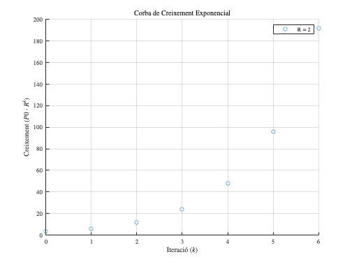

**Cas pràctic: Quan la població de ratolins arribarà a 1 milió?**


Anem a calcular quants anys trigarà la població de ratolins en una illa deserta a arribar a **1 milió** d'individus en dos escenaris:

1.  **Sense aportacions externes**: la població creix únicament a causa del creixement natural (30% anual).
2. **Amb aportacions externes**: cada any arriben **20 ratolins nous** a l'illa, a més del creixement natural.

**Opció 1: Sense aportacions externes**


Per aquest escenari, només tenim el creixement natural exponencial, de manera que podem utilitzar la fórmula bàsica del creixement poblacional exponencial:

 $$ P(t+1)=P(t)\cdot (1+r) $$ 

 $$ P(t)=P(0)\cdot (1+r)^t $$ 

On:

-  $P(t)=1.000.000$ (la població objectiu és d'1 milió de ratolins), 
-  $P(0)=100$ (població inicial), 
-  $r=0,3$ (taxa de creixement natural anual del 30%). 

```matlab
% Paràmetres inicials
P0 = 100;        % Població inicial
r = 0.30;        % Taxa de creixement natural (30%)
P_target = 1e6;  % Objectiu de població (1 milió)

% Càlcul del temps necessari per arribar a 1 milió de ratolins
t = log(P_target / P0) / log(1 + r);

% Mostrar el resultat
fprintf('Sense aportacions externes, la població arribarà a 1 milió en %.2f anys.\n', t);
```

```matlabTextOutput
Sense aportacions externes, la població arribarà a 1 milió en 35.11 anys.
```

**Opció 2: Amb aportacions externes**


En aquest escenari, utilitzem la fórmula de Malthus amb aportacions externes:

 $$ P(t+1)=P(t)\cdot (1+r)+A $$ 

Es un exercici no trivial pero interessant veure que la formula basica es:

 $$ P(t)=P(0)\cdot (1+r)^t +A\cdot \frac{(1+r)^t -1}{r} $$ 

On, a part dels parametres definits mes amunt:

-  $A=20$ (aportació externa constant de ratolins per any). 

En aquest cas, enlloc d'usar la formula basica, mostrarem com construir un proces iteratu per a cercar el valor desitjat:

```matlab
% Paràmetres inicials
P0 = 100;        % Població inicial
r = 0.30;        % Taxa de creixement natural (30%)
A = 20;          % Aportacions externes (20 ratolins per any)
P_target = 1e6;  % Objectiu de població (1 milió)

% Inicialització de variables
t = 0;           % Temps inicial
P_t = P0;        % Població inicial

% Iterar fins arribar a la població objectiu
while P_t < P_target
    t = t + 1;  % Incrementar el temps
    P_t = P_t * (1 + r) + A % Càlcul de la població
end
```

```matlabTextOutput
P_t = 150
P_t = 215
P_t = 299.5000
P_t = 409.3500
P_t = 552.1550
P_t = 737.8015
P_t = 979.1420
P_t = 1.2929e+03
P_t = 1.7007e+03
P_t = 2.2310e+03
P_t = 2.9203e+03
P_t = 3.8163e+03
P_t = 4.9813e+03
P_t = 6.4956e+03
P_t = 8.4643e+03
P_t = 1.1024e+04
P_t = 1.4351e+04
P_t = 1.8676e+04
P_t = 2.4299e+04
P_t = 3.1608e+04
P_t = 4.1111e+04
P_t = 5.3464e+04
P_t = 6.9523e+04
P_t = 9.0400e+04
P_t = 1.1754e+05
P_t = 1.5282e+05
P_t = 1.9869e+05
P_t = 2.5832e+05
P_t = 3.3583e+05
P_t = 4.3660e+05
P_t = 5.6760e+05
P_t = 7.3790e+05
P_t = 9.5929e+05
P_t = 1.2471e+06
```

```matlab

% Mostrar el resultat
fprintf('Amb aportacions externes, la població arribarà a 1 milió en %d anys.\n', t);
```

```matlabTextOutput
Amb aportacions externes, la població arribarà a 1 milió en 34 anys.
```

Grafic del sistema:

```matlab
% Paràmetres inicials
P0 = 100;        % Població inicial
r = 0.30;        % Taxa de creixement natural (30%)
A = 20;          % Aportacions externes (20 ratolins per any)
P_target = 1e6;  % Objectiu de població (1 milió)

% Inicialització de temps
t_max = 40;  % Temps màxim per a la simulació (en anys)

% Inicialitzem vectors per emmagatzemar resultats
t = linspace(0,t_max,40); % Vector de temps
P_no_A = zeros(size(t)); % Població sense aportacions externes
P_with_A = zeros(size(t)); % Població amb aportacions externes

% Càlcul de la població per a cada temps
for i = 1:length(t)
    % Sense aportacions externes
    P_no_A(i) = P0 * (1 + r)^t(i);
    
    % Amb aportacions externes
    P_with_A(i) = P0 * (1 + r)^t(i) + A * ((1 + r)^t(i) - 1) / r;
end

% Dibuixant les corbes
figure;
scatter(t, P_no_A, 'b'); % Corba sense aportacions externes
hold on;
scatter(t, P_with_A, 'r'); % Corba amb aportacions externes
yline(P_target, '--k', 'Objectiu de 1 Milió'); % Línia horitzontal per l'objectiu
xlabel('Temps (anys)');
ylabel('Població');
title('Evolució de la Població de Ratolins');
legend('Sense Aportacions Externes', 'Amb Aportacions Externes');
grid on;
hold off;
saveas(gcf, '../figures/MalthusRatolins.png');
```




