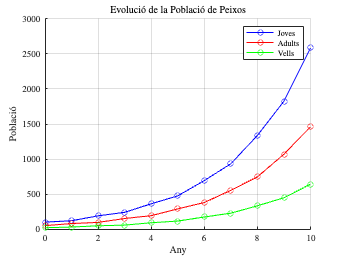

<script src="https://cdn.mathjax.org/mathjax/latest/MathJax.js?config=TeX-AMS-MML_HTMLorMML" type="text/javascript"></script>

# **1.2. Models Multidimensionals Lineals. Matrius de Leslie**
\matlabtableofcontents

**Algunes instruccions preliminars:**

```matlab
startup
```


## Cas: Estudi d'una població de peixos dividida per rangs d'edat

Un **model matemàtic discret multidimensional** utilitzant una **matriu de Leslie** és una manera efectiva de modelar poblacions d'espècies en biologia, on es poden considerar múltiples classes d'edat o etapes del cicle de vida. La matriu de Leslie és una matriu de transició que captura com les poblacions d'una espècie evolucionen al llarg del temps, tenint en compte la fecunditat i la supervivència.


**Exemple de Cas****Context**


Considerem una població de peixos que es divideix en tres classes d'edat:

1.  Joves (menys d'1 any)
2. Adults (entre 1 i 2 anys)
3. Vells (de 2 a 3  anys) (després tots moren)

**Fecunditat** i **taxes de supervivència** per cada classe d'edat:

-  **Joves**: Fecunditat: 0; Taxa de supervivència: 0.8 
-  **Adults**: Fecunditat: 2 (produïxen 2 joves per any); Taxa de supervivència: 0.6 
-  **Vells**: Fecunditat: 1 (produïxen 1 jove per any); Taxa de supervivència: 0 
```matlab
% Definició de la matriu de Leslie
L = [0, 2, 1;    % Fecunditat
     0.8, 0, 0; 
     0, 0.6, 0];

% Vector de població inicial
N0 = [100; 50; 20]; % Joves, Adults, Vells

% Nombre d'anys a simular
n_years = 10;

% Inicialitza una matriu per emmagatzemar les poblacions
populations = zeros(n_years + 1, 3);
populations(1, :) = N0'; % Població inicial

% Simula l'evolució de la població
for t = 1:n_years
    populations(t + 1, :) = (L * populations(t, :)'); % Evolució de la població
end

% Mostra les poblacions
disp('Evolució de la població:');
```

```matlabTextOutput
Evolució de la població:
```

```matlab
disp('Any | Joves | Adults | Vells');
```

```matlabTextOutput
Any | Joves | Adults | Vells
```

```matlab
for t = 0:n_years
    fprintf('%4d | %6.2f | %6.2f | %6.2f\n', t, populations(t + 1, 1), populations(t + 1, 2), populations(t + 1, 3));
end
```

```matlabTextOutput
   0 | 100.00 |  50.00 |  20.00
   1 | 120.00 |  80.00 |  30.00
   2 | 190.00 |  96.00 |  48.00
   3 | 240.00 | 152.00 |  57.60
   4 | 361.60 | 192.00 |  91.20
   5 | 475.20 | 289.28 | 115.20
   6 | 693.76 | 380.16 | 173.57
   7 | 933.89 | 555.01 | 228.10
   8 | 1338.11 | 747.11 | 333.00
   9 | 1827.23 | 1070.49 | 448.27
  10 | 2589.25 | 1461.78 | 642.29
```

```matlab

% Anàlisi de vectors propis i valors propis
[eigenvectors, eigenvalues] = eig(L) % Càlcul de vectors i valors propis
```

```matlabTextOutput
eigenvectors = 3x3
    0.8481   -0.7606    0.1856
    0.4866    0.5667   -0.4631
    0.2094   -0.3167    0.8667

eigenvalues = 3x3
1.3944         0         0
         0   -1.0738         0
         0         0   -0.3206

```

```matlab

% Extracció del valor propi dominant
dominant_eigenvalue = max(diag(eigenvalues)); % Valor propi dominant
dominant_eigenvector = eigenvectors(:, find(diag(eigenvalues) == dominant_eigenvalue)); % Vector propi dominant

% Normalització del vector propi dominant
dominant_eigenvector = dominant_eigenvector / sum(dominant_eigenvector);

% Mostra els resultats de l'anàlisi
fprintf('\nAnàlisi dels vectors propis:\n');
```

```matlabTextOutput
Anàlisi dels vectors propis:
```

```matlab
fprintf('Valor propi dominant: %.4f\n', dominant_eigenvalue);
```

```matlabTextOutput
Valor propi dominant: 1.3944
```

```matlab
fprintf('Vector propi dominant (proporcions): [%.4f, %.4f, %.4f]\n', dominant_eigenvector);
```

```matlabTextOutput
Vector propi dominant (proporcions): [0.5493, 0.3151, 0.1356]
```

```matlab

% Gràfic de l'evolució de la població
figure;
hold on;
plot(0:n_years, populations(:, 1), '-o', 'DisplayName', 'Joves', 'Color', 'b');
plot(0:n_years, populations(:, 2), '-o', 'DisplayName', 'Adults', 'Color', 'r');
plot(0:n_years, populations(:, 3), '-o', 'DisplayName', 'Vells', 'Color', 'g');
title('Evoluci\''o de la Poblaci\''o de Peixos');
xlabel('Any');
ylabel('Població');
legend('show');
grid on;
hold off;
```



```matlab
% Gràfic de les proporcions del vector propi dominant
figure;
bar(dominant_eigenvector, 'FaceColor', [0.2 0.6 0.8]);
title('Proporcions del Vector Propi Dominant');
xlabel('edat');
ylabel('Proporci\''o');
set(gca, 'XTickLabel', {'Joves', 'Adults', 'Vells'});
grid on;
```

## Qüestions
1.  Millora l'script incloent a la taula la fracció entre la quantitat total d'individus en dos períodes de tempos consecutius, així com la fracció entre individus dels diferents tipus a cada generació.
2. Com evoluciona la població si els individus vells tenen una supervivència del 20%, alhora que els individus joves només del 10%?
3. En un model amb tres classes d'edat, el comportament asimptòtic de la població ve determinat pel valor propi dominant λ1=1.3λ1�=1.3 i el vector propi associat v=(0.9,0.3,0.18)v=(0.9,0.3,0.18). Quin serà el comportament asimptòtic de la població?
4. Per estudiar una població d'una determinada espècie, la màxima edat de la qual és de 20 anys, es consideren períodes vitals de 5 anys i es divideix la població en 4 grups d'edat. De l'observació es dedueix que només una quarta part dels individus del primer grup (1\-5 anys) sobreviu fins al següent període de temps; que només la meitat dels del segon grup (6\-10 anys) sobreviuen fins als (11\-15 anys) i només una desena part dels d'aquest últim arriben al darrer grup (16\-20 anys). Així mateix, s'observa que, de mitjana, cada individu del segon grup procrea un nou individu, mentre que els dels grups 3 i 4 procreen 3 i 2 nous individus, respectivament.

-  Escriu el model de Leslie per a aquestes dades en forma matricial. 
-  Si inicialment la distribució de la població per grups és de 100, 70, 70 i 40 individus respectivament, determina la distribució que hi haurà d'aquí a 10 anys (recorda que els períodes són de 5 anys). 
